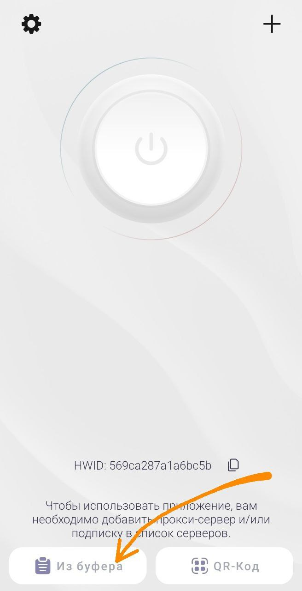
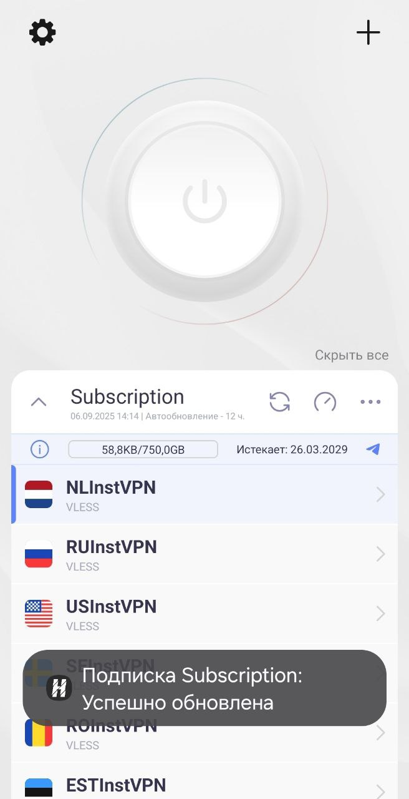
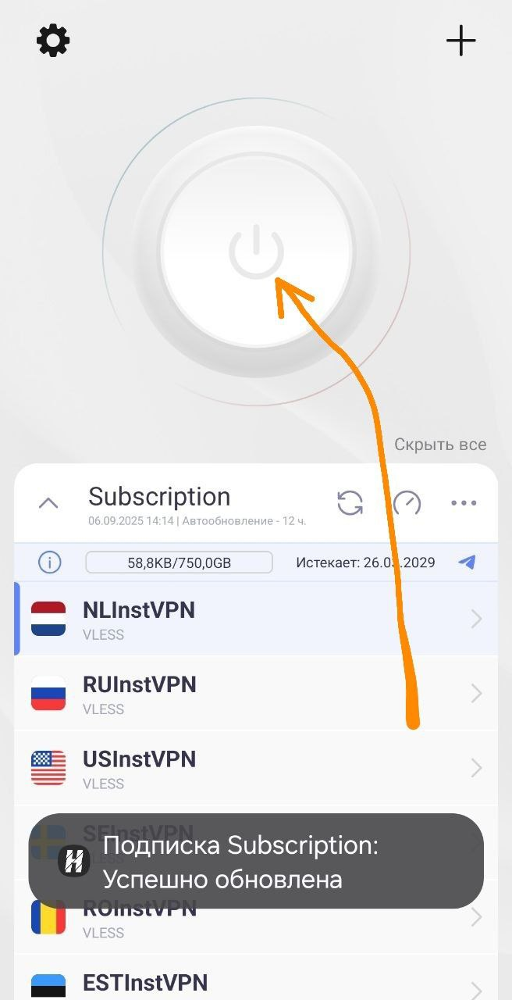
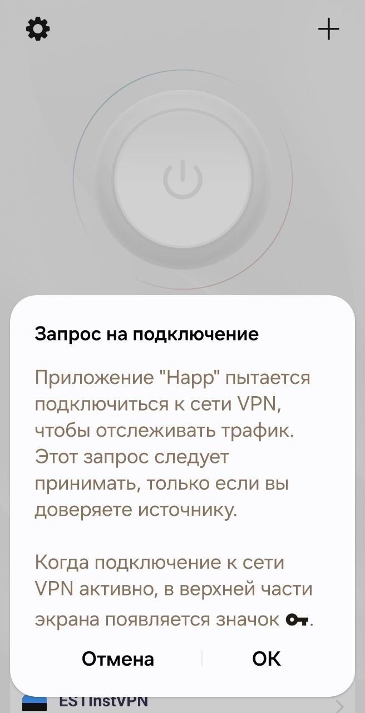
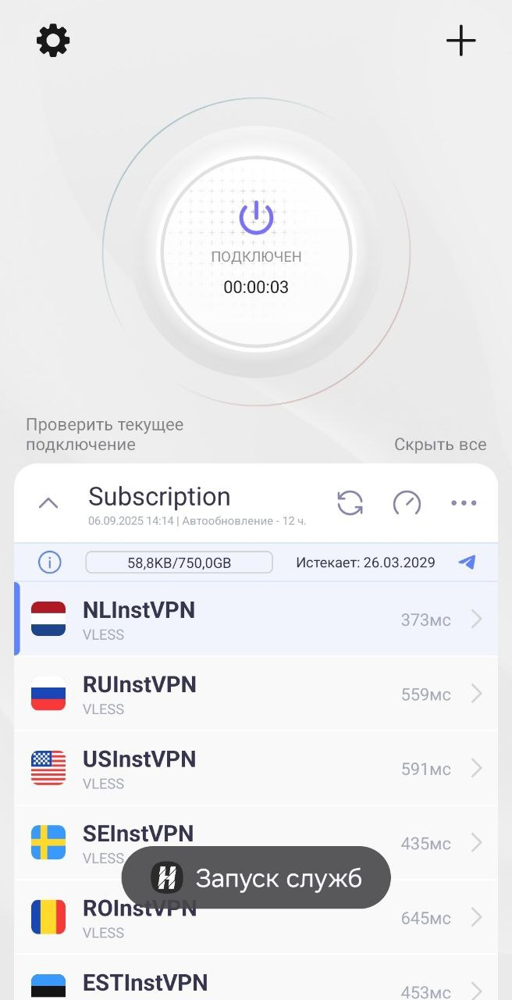

# **Android-Happ**

Сентябрь 24, 2025

Установка Happ:

**1. Загрузка приложения:**

Перейдите в Google Play Store: https://play.google.com/store/apps/details?id=com.happproxy

Установите приложение "Happ".

**2. Настройка Happ:**

Запустите приложение Happ.

Скопируйте вашу ссылку для подключения из бота(нажмите кнопку "⚡️ Подключиться!")

Добавление профиля:

Нажмите на кнопку "Из буфера".

Появится новая подписка ниже

Выберите подходящую локацию. И нажмите кнопку "Подключиться".

Нажмите "ОК".

Нажмите кнопку "Подключиться".

Дождитесь изменения статуса на "Подключен".

Вы великолепны! Наслаждайтесь интернетом без ограничений!

Если у вас возникли сложности - пожалуйста напишите в техподдержку. Мы поможем. 
